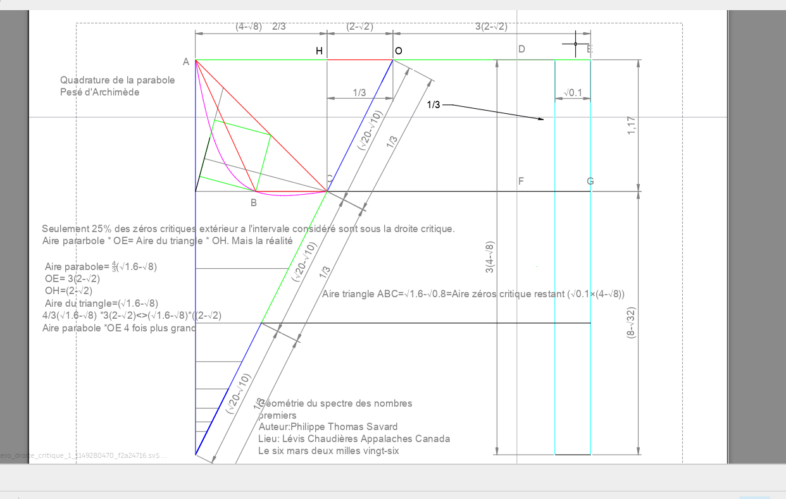

# SCRIPT NARRATIF
## L'Univers est au Carre -- Philippe Thomas Savard

*Version E1 2.0 -- Restructuree, enrichie et mise a jour*

---

> *Comment la theorie "L'Univers est au Carre", avec ses concepts de transformation
> geometrique et de validation formelle, remet-elle en question notre vision
> conventionnelle de l'univers comme un espace de dimensions interagissant
> lineairement, et quelles implications cela a-t-il sur la nature meme du savoir
> scientifique et notre comprehension philosophique de la realite ?*

La theorie "L'Univers est au Carre" propose une interpretation de l'univers ou les
transformations geometriques, telles que la quadrature, servent de moyen pour reveler
les proprietes cachees des structures fondamentales. Ce concept suggere que l'univers
pourrait etre compris en termes de transformations non lineaires qui echappent a la
perception conventionnelle. En introduisant la formalisation rigoureuse via des outils
comme Isabelle/HOL, la theorie insiste sur une epistemologie ou la verite scientifique
depend autant de l'elegance des transformations geometriques que de leur demonstration
formelle. Ce changement de paradigme conduit a une vision ou le savoir n'est plus une
simple accumulation de faits lineaires, mais une comprehension profonde des interactions
complexes entre les concepts mathematiques, redefinissant ainsi notre comprehension
philosophique des lois regissant la realite.

---

## INTRODUCTION

Philippe Thomas Savard, libre penseur autodidacte originaire de Levis, au Canada,
incarne parfaitement l'idee que la curiosite personnelle et le questionnement
inebranlable peuvent mener a des decouvertes mathematiques remarquables. Avec un
parcours qui echappe aux sentiers battus du monde academique traditionnel, Savard
s'est rapidement distingue par son interet profond et singulier pour les nombres.
Ce cheminement autodidacte, marque par la passion et l'insatiable desir de comprendre,
l'a conduit a elaborer une theorie mathematique originale que nous explorerons dans
ce documentaire.

Au coeur de sa theorie, baptisee "L'Univers est au Carre", se trouve le desir ardent
de Savard de proposer une nouvelle perspective sur la distribution des nombres premiers.
Pour l'auteur, il s'agit d'une opposition manifeste a ceux qui, par defaut de le faire
eux-memes, cherchent a desheriter la connaissance de chacun. Cette lutte ideologique est
la source premiere qui a motive Savard a presenter un travail rigoureux, ou chaque methode
est tissee de maniere a reveler de nouvelles structures grace a des outils sophistiques,
formalises et valides a l'aide du logiciel Isabelle/HOL et d'un corpus de meme nature.

Les cinq chapitres de cette theorie offrent une exploration systematique et innovante.
Le premier, *Geometrie du spectre des nombres premiers*, devoile comment Savard a
redessine le paysage mathematique pour illustrer une nouvelle vision des nombres
primitifs. Le second, *Mecanique harmonique du chaos discret*, applique des methodes
originales pour comprendre l'imprevisible harmonie du chaos. Le troisieme,
*Postulat de l'univers est au carre*, propose un postulat central resumant l'idee que
l'univers mathematique peut etre reconceptualise a travers la simplicite d'un carre.
Le quatrieme, *Espace de Philippot*, baptise un nouveau cadre conceptuel marquant
l'empreinte de l'auteur dans le monde des mathematiques. Enfin, le cinquieme,
*Teleosemantique et philosophie*, tisse les fils philosophiques presents dans chaque
partie de la theorie.

Chaque composant mathematique est entrelace d'une fibre philosophique. Cette approche
integrative met en lumiere comment le domaine mathematique n'est pas seulement une quete
de verite numerique, mais aussi un voyage dans la pensee humaine. Preparez-vous a
parcourir les meandres de cette theorie captivante, ou les mathematiques rencontrent
la philosophie dans une danse intellectuelle qui porte la signature indelebile de
Philippe Thomas Savard.

---

## CHAPITRE 1 -- LA GEOMETRIE DU SPECTRE DES NOMBRES PREMIERS

La geometrie du spectre des nombres premiers est une exploration qui trouve son
origine dans une observation simple mais profondement significative : lorsqu'on
examine les relations entre des nombres entiers successifs, un rapport constant
emerge. Ce rapport se revele etre un fondement crucial pour l'elaboration des
methodes ulterieures, ouvrant ainsi une perspective unique sur la comprehension
de la nature des nombres premiers.

### Les suites spectrales A et B

Au coeur de cette methode se trouvent deux suites fondamentales :

- **Suite A :** SA(n) = (3.25 / 2) * 2^n - 2
- **Suite B :** SB(n) = (6.5 / 2) * 2^n - 66

Ces deux suites, formalisees dans le fichier Isabelle/HOL *methode_spectral.thy*,
entretiennent entre elles un rapport spectral constant. La preuve, verifiee par
le noyau d'Isabelle, etablit que pour tous n1 et n2 distincts et strictement positifs :

    RsP(n1, n2) = (SA(n1) - SA(n2)) / (SB(n1) - SB(n2)) = 1/2

Ce resultat constitue la pierre angulaire de la theorie : le rapport spectral
demeure invariant, quelle que soit la paire d'indices choisie. Ce meme principe
s'etend aux rapports 1/3 et 1/4, chacun fonde sur des suites spectrales modifiees,
et verifie de la meme maniere par le noyau Isabelle.

### Exemple illustratif : le 10e nombre premier

Voici un exemple concret pour le nombre premier 29 (10e nombre premier) :

Suite A (10 termes) :

    2 + 4 + 8 + 16 + 32 + 64 + 128 + 256 + 384 + 768 = 1662

Suite B (10 termes) :

    2 + 4 + 8 + 16 + 32 + 128 + 256 + 512 + 768 + 1536 = 3262

Le Digamma calcule pour la 8e position de la suite A donne :

    Digamma calcule = 1662 - 256 = 1406

La determination du nombre premier s'effectue alors par :

    (Somme B - Digamma calcule) / (6e position zeta) = (3262 - 1406) / 64 = 29

Le 10e nombre premier est bien 29, ce que confirme la suite naturelle :
2, 3, 5, 7, 11, 13, 17, 19, 23, 29.

### Comparaisons spectrales : symetrique, asymetrique ordonnee et chaotique

Les rapports spectraux se manifestent sous trois formes de comparaison distinctes,
chacune revelant un aspect different de la structure des nombres premiers.

**La comparaison symetrique** (1x1 ou nxn) implique des ensembles de nombres
premiers de cardinalite strictement equivalente. La structure est formalisee dans
*geometrie_spectre_premier.thy* a travers des types record et des predicats de
validite, permettant d'exprimer les conditions structurelles sans imposer d'equation.

**La comparaison asymetrique ordonnee** exige deux conditions fondamentales.
La premiere est le desequilibre structurel : le bloc B doit imperativement contenir
un terme de plus que le bloc A, et ce terme supplementaire doit etre un nombre premier.
La seconde condition exige que les deux blocs soient organises selon un ordre
strictement croissant et chronologique.

Un exemple de comparaison asymetrique ordonnee :

    (2 - 3 - 5 - 7 - 11) compares a (13 - 17 - 19 - 23 - 29 - 31)

Dans ce cas, B = A + 1, creant le desequilibre requis. Cette comparaison produit
une valeur spectrale differente du rapport attendu, car l'on attribue deux fois
une valeur objective a la meme entite : les suites A et B possedent deja une valeur
definie par leur construction, puis on leur attribue une seconde valeur en les
ordonnant chronologiquement. Cette double attribution produit un rapport spectral
distinct de 1/2.

L'auteur interprete cette observation comme une analogie du rapport entre l'univers
materiel et la realite qui l'entoure. Lorsque nous attribuons une qualite objective
a l'univers materiel, puis que notre esprit en produit une representation
cartographique, nous effectuons une seconde mise en relation. Or, cette seconde
relation demeure du meme rapport que la premiere, car elle appartient toujours a
la sphere de l'entite definie.

**La comparaison asymetrique chaotique**, fondee sur la nature chaotique de la
repartition des nombres premiers dans l'ensemble des entiers, confirme que ce qui
releve d'une entite definie reste en rapport direct avec celle-ci. L'organisation
mentale que nous produisons n'altere pas ce rapport ; elle ne fait que refleter
l'etat structure de notre intelligence.

Exemple de comparaison chaotique (3, 23) et (41, 29, 31) :

    ((9/2 - 830) - (13310 - 1662 - 3326)) / ((-53 - 1598) - (26558 - 3262 - 6590))
    = 0.4983112709

Au sens philosophique, les definitions de *asymetrique_ordonnee* et
*asymetrique_chaotique* dans le fichier *methode_spectral.thy* formalisent des
structures ou les indices d'une suite d'entiers remplissent des conditions
specifiques d'ordre ou de deviation du chaos. Ce concept dual d'ordre et de chaos
illustre comment ces deux forces coexistent comme deux faces d'une meme medaille,
refletant une vision philosophique ou la realite est percue comme un tissu complexe
tisse d'ordre et de desordre imbriques.

### L'ecart entre les nombres premiers

La methode spectrale inclut egalement une section traitant de l'ecart entre les
nombres premiers. Cette section met en avant une methode utilisant la somme des
suites A et B pour determiner cet ecart. Trois cas distincts sont ainsi demontres
et valides par le script HOL d'Isabelle.

**Cas positif-positif (+,+) :** Ecart entre 23 et 7.

    SA(11) = 50
    SB(23) = 1598
    Digamma(23) = 1406
    Combinaison : 50 - (1598 - 126) = -1442
    SB(7) = -14
    Digamma(7) = -464
    Resultat : (-1442 - (-464)) / 64 = -15

Il y a 15 nombres entre 7 et 23 : 8, 9, 10, 11, 12, 13, 14, 15, 16, 17, 18, 19, 20, 21, 22.

**Cas negatif-negatif (-,-) :** Ecart entre -19 et -5.

    SA(-7) = -10110/5120
    SB(-3) = -20860/320
    Resultat final : -13

Il y a 13 nombres entre -19 et -5.

**Cas mixte (-,+) :** Ecart entre -31 et 17.

    SA(-29) = -40895/20480
    SB(17) = 350
    Resultat final : -47

Il y a 47 nombres entre -31 et 17.

### L'ecart mixte et la conjecture de Riemann

Le cas mixte est le plus revelateur pour l'auteur. L'ecart mixte ajoute
systematiquement 1 a chaque ecart entre deux nombres premiers, en raison de
l'inclusion du zero comme point de transition. Cette particularite permet des
combinaisons symetriques telles que -2 et 2, -3 et 3, -5 et 5, de sorte que
l'ecart mixte contient davantage de nombres premiers que les ecarts positifs
ou negatifs.

Puisque la fonction zeta permet de determiner la position de tous les nombres
premiers -- ce qui est egalement le cas de la methode validee par Isabelle dans
*methode_spectral.thy* -- l'ecart mixte permet de considerer l'ensemble des zeros
de la droite critique dans un rectangle. L'auteur propose de considerer un
intervalle allant de 0 a un nombre premier d'une valeur determinee. Le rectangle
peut alors etre tronque d'une partie representant l'ensemble des zeros de la
droite critique.

L'ecart mixte, en ajoutant 1 a chaque ecart, produit une valeur relative plus
grande que la valeur maximale initiale du rectangle tronque. Ainsi, la droite
critique apparait courbee. L'auteur affirme que si l'aire comprise entre la
droite critique courbee et la droite critique habituelle est egale a l'aire
restante du rectangle tronque, alors cette egalite constituerait une demonstration
permettant de conclure a la veracite de la conjecture de la fonction zeta.

La figure de la quadrature de la parabole, reproduite selon les dimensions de la
regle de Philippot, montre que l'aire de la parabole correspond a celle de la
section restante multipliee par 4/3. Ce facteur 4, integre dans l'ecart mixte,
inclut toutes les combinaisons identiques position pour position, ce qui explique
l'egalite des aires.

C'est pourquoi, a la question de l'hypothese de Riemann formulee par Philippe Thomas
Savard -- "Est-ce que tous les zeros non triviaux de la fonction zeta de Bernhard
Riemann ont tous pour partie reelle 1/2" -- la reponse qu'il propose est : **non**.

### Axiomatisation dans Isabelle/HOL

L'axiomatisation du fichier *methode_spectral.thy* prolonge les principes exposes
dans les chapitres precedents en leur donnant une formulation logique et formelle.
Elle introduit un type abstrait pour les zeros non triviaux de la fonction zeta,
ainsi que des fonctions donnant leur partie reelle et imaginaire. L'axiome
*explicit_formula_axiom* formalise le principe selon lequel les zeros de zeta
determinent la position des nombres premiers.

Sur le plan spectral, la section formalise la structure propre a la methode de
Philippot : un type d'indices spectraux, des suites A et B dont la somme encode
la valeur spectrale de n, et un rapport spectral 1/k entre nombres premiers
spectraux. L'axiome de concordance *concordance_spectrale* relie les deux mondes :
pour chaque indice spectral n, il existe un zero de zeta qui intervient dans la
determination de la position du nombre premier associe.

Axiomatisation de la geometrie du spectre des nombres premiers, dans les mots
de l'auteur :

> *"Quand n >= 1 et que n <= -1, tous les n ramenent a un nombre premier P.
> Toutes les valeurs de n sont la consequence de la quantite de termes dans
> les suites A et B. Tous les P entre eux respectent le rapport spectral 1/k.
> Ce rapport spectral est numeriquement valide, algebriquement incoherent."*
> -- Philippe Thomas Savard, le dix avril deux mille vingt-six.

### Le produit alternatif et la methode de tamisage

Au coeur de cette exploration se trouve egalement la methode du produit alternatif.
Cette methode novatrice conjugue les proprietes geometriques de figures distinctes :
le produit entre le perimetre d'une figure et le diametre d'une autre figure est
invariablement egal au produit inverse.

    Perimetre du carre A x diametre du carre B = Diametre du carre A x perimetre du carre B

Le produit alternatif asymetrique, pour sa part, s'ecrit :

    Aire A x Aire C = Aire B x Aire D = Volume de la piece

Pour l'auteur, il s'agit du volume du tesseract qui se replie perpetuellement.

Suivant cette realisation, l'analyse se poursuit avec l'application de l'analyse
numerique metrique. En s'inspirant de la granulometrie, cette approche adopte une
technique de tamisage rigoureuse. Les nombres sont passes au crible a travers deux
sequences distinctes, permettant des comparaisons entre figures geometriques dont
les aires conservent toujours le meme rapport.

C'est ici qu'intervient l'auteur en tant que libre penseur, un analogiste qui percoit
les mathematiques comme grammaire. Ancre dans une pensee synthetique ou chaque cause
connait prealablement son effet, il explore et demontre des connexions ou l'effet est
inevitablement imbrique avec sa cause, revelant un univers ou la beaute des nombres
premiers se marie a une syntaxe geometrique complexe et meticuleuse.

---

## CHAPITRE 2 -- LA MECANIQUE HARMONIQUE DU CHAOS DISCRET

Dans l'univers fascinant de la geometrie fractale, l'auteur se penche sur une
construction particuliere qui sert de toile de fond a l'exploration de la mecanique
harmonique du chaos discret. Cette exploration debute par la mise en place d'une
figure fondamentale : deux carres ingenieusement emboites, riches de symetrie et de
regularite, sont inscrits dans un quadrillage fractal. Les triangles inherents a
cette configuration deviennent les pieces maitresses revelant la mecanique sous-jacente.

### L'invariance geometrique

Le concept cle de cette demarche est l'invariance geometrique. Pour chaque unite
geometrique construite sous la forme de racine de p augmentee d'une unite
(sqrt(p) + 1), existe une relation stable et coherente entre les longueurs associees.
L'invariance implique que, independamment de la fluctuation de p, la configuration
conserve une equivalence structurale.

Cet axiome est formalise dans le fichier *mecanique_discret.thy*, ou le rapport
fondamental entre demi-base et hauteur est demontre egal a sqrt(p) pour tout nombre
premier p. L'unite geometrique issue de la figure s'aligne sans faille avec l'unite
abstraite predefinies.

L'auteur propose par ailleurs une nouvelle possibilite pour l'invariance geometrique
-- habituellement reservee a la translation, l'homothetie et la reflexion. Dans
ce chapitre, il avance l'opinion d'une nouvelle invariance ou le choix de l'unite
par l'observateur influence la position de la mesure dans l'espace. Cette approche
remarquable est detaillee dans un schema ou une succession de figures geometriques
determine un systeme d'equations definissant un diametre equivalent, et ou les
positions consequentes suivent la progression des nombres premiers.

### La signification ontologique

La theorie suggere que tous les phenomenes de l'univers peuvent etre interpretes a
travers le prisme de cette geometrie. Ontologiquement, cela implique que l'univers,
souvent percu comme un ensemble chaotique de lois naturelles, peut etre simplifie a
travers des principes geometriques qui unifient differents etats de la realite.
Savard trace un remarquable parallele avec la relativite restreinte et l'effet
Doppler, suggerant que la position de l'observateur influence la mesure -- une idee
que la regle des inverses des carres formalise.

### Les matrices et la derivee premiere

La demarche s'illustre a travers l'utilisation de trois matrices successives.
Dans la premiere, les dimensions geometriques reelles sont scrupuleusement capturees,
formant le socle concret de l'analyse. La troisieme matrice intervient pour normaliser
le systeme avec des coefficients premiers, liberant la structure des particularites
individuelles et devoilant la charpente arithmetique profonde en jeu.

**Matrice simplifiee :**

| 1er terme | 2e terme | 3e terme | egalite |
|-----------|----------|----------|---------|
| 37x       | +31x     | +29x     | = 41x   |
| 19y       | +17y     | +13y     | = 23y   |
| 7z        | +5z      | +3z      | = 11z   |

### Le produit alternatif

Le produit alternatif se definit comme :

    P x ((1/2) / ((sqrt(P)+1) / sqrt(18)))^2 = (1/2) / ((sqrt(P)+1) / sqrt(18)) x invariance geometrique

Le produit alternatif permet de determiner le diametre equivalent au carre :

    (sqrt(4P) x sin(arcsin((1/2) / (((sqrt(P)+1) / sqrt(18))) x 1/2)))^2 = Diametre equivalent^2

Pour conclure cette demarche, le lecteur est guide vers une formalisation rigoureuse
dans le fichier Isabelle/HOL. L'axiome fondamental illustre que le rapport entre
demi-base et hauteur possede une liaison indissoluble avec la racine du nombre
premier selectionne.

En filigrane de cette exploration conceptuelle se dessine une pensee philosophique
plus profonde. L'auteur decrit ce travail comme une traduction tissant les liens
entre teleosemantique et "pulsion de vie", ce fantasme de l'objet qui transcende
son existence par ses propres raisons d'etre. La constance des lois geometriques au
sein du chaos discret devient ainsi l'incarnation mathematique de ce lien, exprimant
une rigueur et une regularite universelles au sein des fluctuations apparentes du monde.

---

## CHAPITRE 3 -- LE POSTULAT DE L'UNIVERS EST AU CARRE

Dans ce chapitre, nous explorons un concept audacieux : le postulat de l'univers
est au carre. A la croisee des idees anciennes et des approches contemporaines,
cette theorie aborde la structuration geometrique de notre realite en prenant racine
dans un paradigme carre.

### Le postulat

> *A priori et de la raison pure, si l'on fait le produit carre d'un rectangle,
> ce rectangle eleve au carre est un carre. Cette methode appliquee a toute figure
> en resulte un carre : l'univers est au carre.*

Habituellement, il est possible d'affirmer qu'un carre est un rectangle mais qu'un
rectangle n'est pas un carre, en raison de la caracteristique unique du carre :
quatre cotes congrus. Le postulat renverse cette perspective en montrant qu'un
rectangle eleve au carre engendre un carre. Pour l'auteur, cette approche est sa
version de la relativite d'Einstein : la position de l'observateur influence la mesure,
et l'etirement a des effets physiques qui se calculent souvent par la regle des
inverses des carres.

### La construction geometrique

On considere un rectangle initial ABCD dont les cotes sont :

    AB = CD = sqrt(2) - 1
    AD = BC = 1
    Perimetre = 2(sqrt(2)-1) + 2(1) = sqrt(8)

En elevant ce perimetre au carre, on obtient (sqrt(8))^2 = 8. Le nouveau rectangle
A'B'C'D' a pour cotes :

    A'B' = C'D' = 4 - sqrt(8)
    A'D' = B'C' = sqrt(8)

Le carre maximal inscrit A'B'EF a pour cote (4 - sqrt(8)) et pour aire 1.372583002.
L'aire du rectangle complet est sqrt(128) - 8. Le rapport entre les deux est
sqrt(2) + 1, qui devient l'unite symbolique du postulat.

### Les trois equations fondamentales

Ces trois equations relient les diagonales, les aires et l'unite sqrt(2)+1,
revelant une seconde figure elevee au carre : l'octogone carre.

    1. (2(sqrt(1/3) + sqrt(1/6))^(-1) x sqrt(sqrt(2)+1))^2 = 1.941225497 + (sqrt(8))^2
    2. ((sqrt(32) - 4) x sqrt(sqrt(2) + 2))^2 = 1.372583002 + (sqrt(8))^2
       Octogone carre = (3.061467459)^2
    3. (3.061467459 x ((sqrt(2)+1)/2)^(1/2))^2 = (sqrt(128) - 8) + (sqrt(8))^2

La progression du coefficient k s'ecrit :

    (diagonale x (p+1)^(1/2))^2 = k x aire + h^2

Ce systeme de trois equations est une demonstration des trois caracteristiques
fondamentales du carre. De ce rectangle eleve au carre, la manoeuvre a permis a
l'auteur de determiner un octogone carre, un hexagone carre, et un pentagone carre.

### L'unite symbolique sqrt(3)+1

L'unite symbolique sqrt(3)+1 engage une transformation geometrique ou un rectangle
initial se transforme selon le postulat du squaring en un rectangle nouveau au
perimetre sqrt(24) + 1.793150943 = 6.692130429. Ce procede permet d'encoder une
structure hexagonale, ou le perimetre de l'hexagone est lie a la diagonale du
rectangle transforme. En termes d'analogisme, cette transformation demontre une
correspondance entre des formes geometriques distinctes tout en conservant une
structure interne coherente avec le postulat de depart.

Le squaring se veut une methode non seulement de comprehension, mais d'ajustement
continuel pour assurer la permanence de l'equite et de la clarte dans le discours
geometrique. Le postulat de l'univers est au carre n'est pas une simple hypothese
numerique, mais une proposition philosophique et geometrique remarquable, cherchant
a capturer la symetrie et la complexite de l'univers dans lequel nous evoluons.

---

## CHAPITRE 4 -- L'ESPACE DE PHILIPPOT

L'espace de Philippot est une exploration audacieuse et lumineuse des formes
geometriques, un voyage qui commence avec la spirale de Theodore de Cyrene. Dans
cette premiere etape, la spirale est prise comme base de construction de l'espace
concerne. Cette spirale est unique en son genre, car elle se developpe en utilisant
la valeur des hypotenuses des triangles la constituant.

### La pyramide et les disques

Progressant dans cette logique fascinante, nous rencontrons la structure de
pyramide, caracteristique centrale de l'espace de Philippot. Cette pyramide integre
des disques dont les rayons sont proportionnels entre eux de maniere precise,
evoquant une harmonie visuelle et geometrique egale a celle de la spirale de
Theodore. L'elevation de la pyramide suit scrupuleusement la progression definie par
la spirale initiale. Les hauteurs deviennent des jalons ou les nombres premiers
signalent des points geometriques remarquables.

La formalisation dans *espace_philippot.thy* garantit que pour chaque niveau n,
la structure geometrique est controlee par des puissances carrees exactes :
cote(Lref, n)^2 = n * Lref^2. Les proprietes des hauteurs et des rayons sont
verifiees par sept lemmes machine-prouves, constituant un noyau solide de
resultats formels.

### Les nombres hypercomplexes geometriques

L'etape suivante est l'incorporation des nombres hypercomplexes geometriques.
A la difference des quaternions classiques, les nombres proposes par l'auteur
s'articulent autour de trois composantes intrinsequement geometriques : 2 fois
l'aire d'un disque, plus 2 fois l'aire d'un disque plus le rayon au carre,
et enfin la racine carree de la somme ainsi obtenue. Trois cas sont demontres
et forment ce que l'auteur nomme des nombres hypercomplexes.

### La correspondance pyramide-ellipsoide

Parallelement, une correspondance subtile emerge entre la pyramide et un ellipsoide :
le volume de la pyramide, mesure a une certaine hauteur, represente une fraction
precise et rationnelle du volume d'un ellipsoide construit a partir des memes
parametres. Le volume de la pyramide a la hauteur sqrt(2) est donne par
V_pyramide = 1.6 * (sqrt(2) + sqrt(0.2))^3 = 0.9927611508. Cette revelation
ouvre une perspective nouvelle : la pyramide peut etre interpretee comme une tangente
plane a un ellipsoide de meme essence.

Ainsi, l'espace de Philippot incarne une unification remarquable. En integrant la
spirale de Theodore de Cyrene, les disques associes, les nombres hypercomplexes et
les correspondances volumetriques, il etablit une structure incroyablement coherente
et interconnectee. Cette unification n'est pas simplement structurale ; elle represente,
au sens le plus profond, un pont conceptuel entre diverses abstractions mathematiques.

---

## CHAPITRE 5 -- LA TELEOSEMANTIQUE ET LA PHILOSOPHIE

Dans ce chapitre decisif, nous plongeons dans les profondeurs de la teleosemantique,
une approche qui cherche a combler le fosse entre la forme et la signification tout
en revelant une philosophie de la theorie. C'est une philosophie qui se construit
sur la base d'un analogiste, un grammairien interpretant la grammaire comme une
mathematique. Adepte de la pensee synthetique, l'analogiste intervient la ou les
savoir-faire se veulent frauduleux, dissequant les biais qui obscurcissent notre
comprehension et veillant a retirer les biais algorithmiques.

### Le fil philosophique a travers les chapitres

Des le premier chapitre, nous avons vu se dessiner l'idee d'un rapport spectral
constant, acte pur de raisonnement synthetique. Si toute cause depasse l'obstacle
du hasard pour engendrer un effet coherent, alors la structure se hisse au-dessus
des valeurs, prefigurant un ordre dans cet apparent desordre. L'incoherence presumee
d'un tel rapport n'est pas une faiblesse, mais le signe distinctif d'une distribution
discrete des elements fondateurs par un rapport qui reste le meme.

Avec le deuxieme chapitre, une pulsion de vie insoupconnee -- cette constance et
rigueur dans lesquelles l'esprit humain ose se transcender pour cotoyer ce qu'il y
a au-dela de la contingence. Les matrices qui jalonnent notre comprehension tracent
une ligne allant du concret a l'abstraction, de la mesure a l'immateriel.

Le troisieme jalon fut l'exploration du squaring. Cette discipline exige un regard
tourne vers l'avenir pour evaluer la coherence interne. Elle ouvre la voie a un
specialiste qui depoussiere les methodes inexactes et demasque les subterfuges
intellectuels, garantissant que la quete pour une comprehension plus precise est
menee sans compromission.

### La teleosemantique des nombres premiers

La teleosemantique, dans le contexte de la geometrie du spectre des nombres premiers,
se refere a l'idee que chaque aspect de la geometrie des nombres premiers porte une
signification predeterminee, destinee a explorer les connexions entre structure
mathematique et signification dans le traitement des connaissances numeriques.

La "pulsion de vie" est decrite comme une force impliquee qui pousse a comprendre
des concepts abstraits et geometriques, liant l'energie vitale a notre capacite de
saisir la complexite des spectres numeriques.

En nommant l'antinomisme pour ce qu'il est -- une posture usurpatrice masquant une
fraude sous couvert de libre esprit -- l'auteur dessine un cadre dans lequel ceux
qui cherchent a deformer le connu sont demasques.

---

## FIN DU SCRIPT

---

*Script narratif V.E1 2.0 -- Theorie mathematique de Philippe Thomas Savard*
*"L'Univers est au Carre"*
*Genere et restructure a partir de la V.P. et enrichi par la banque de Q&R (101 questions)*
