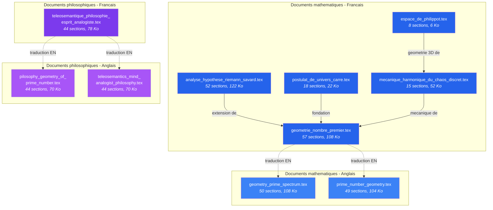
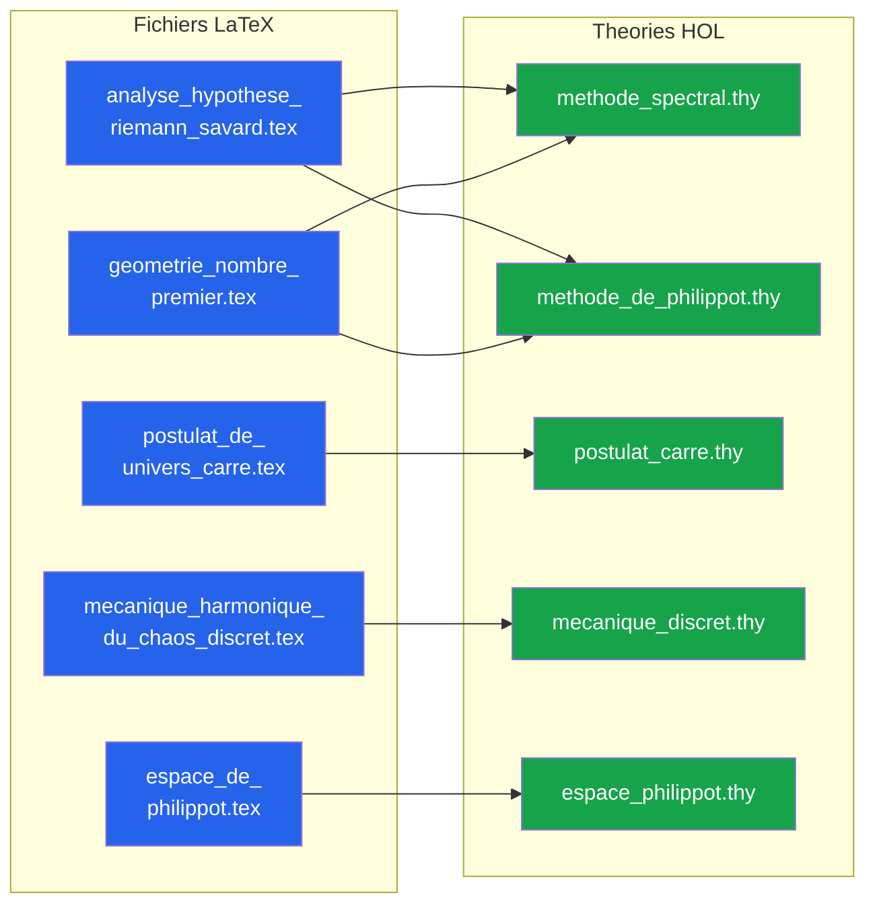
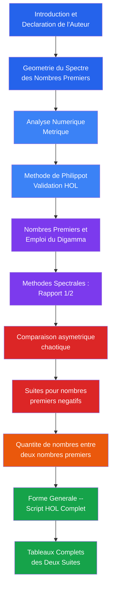
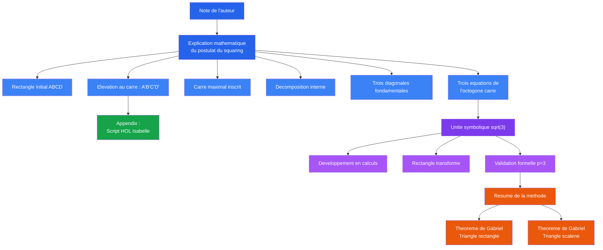
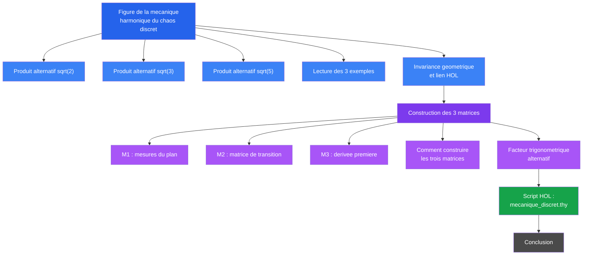

# Arborescence documentaire LaTeX

## Documents source -- Theorie de l'Univers est au Carre

**Generee le :** 2026-04-13
**Documents :** 10 fichiers `.tex`

---

## Schema des relations entre documents

**Legende :**
- **Bleu fonce** : Documents mathematiques en francais (sources principales)
- **Bleu clair** : Traductions anglaises des documents mathematiques
- **Violet fonce** : Document philosophique en francais
- **Violet clair** : Traductions anglaises du document philosophique
- Fleche pleine : relation conceptuelle
- Fleche pointillee : relation de traduction

---

## References croisees LaTeX ↔ HOL

---

## Detail par document

### analyse_hypothese_riemann_savard.tex

| Propriete | Valeur |
|-----------|--------|
| Taille | 122 456 octets |
| Sections | 52 |
| Langue | Francais |
| HOL references | `methode_spectral.thy`, `methode_de_philippot.thy` |

---

### postulat_de_univers_carre.tex

| Propriete | Valeur |
|-----------|--------|
| Taille | 22 774 octets |
| Sections | 18 |
| Langue | Francais |
| HOL references | `postulat_carre.thy` |

---

### mecanique_harmonique_du_chaos_discret.tex

| Propriete | Valeur |
|-----------|--------|
| Taille | 52 339 octets |
| Sections | 15 |
| Langue | Francais |
| HOL references | `mecanique_discret.thy` |

---

### espace_de_philippot.tex

| Propriete | Valeur |
|-----------|--------|
| Taille | 6 346 octets |
| Sections | 8 |
| Langue | Francais |
| HOL references | `espace_philippot.thy` |

**Structure :**

| # | Section |
|---|---------|
| 1 | Introduction |
| 2 | Structure geometrique de l'Espace de Philippot |
| 3 | Nombres hypercomplexes geometriques |
| 4 | Aires des quatre faces a la hauteur sqrt(2) |
| 5 | Volume de la pyramide et correspondance ellipsoidale |
| 6 | Relations exactes validees dans HOL |
| 7 | Conclusion |

---

### geometrie_nombre_premier.tex

| Propriete | Valeur |
|-----------|--------|
| Taille | 108 709 octets |
| Sections | 50 |
| Langue | Francais |
| HOL references | `methode_spectral.thy`, `methode_de_philippot.thy` |
| Traductions | `geometry_prime_spectrum.tex`, `prime_number_geometry.tex` |

---

### teleosemantique_philosophie_esprit_analogiste.tex

| Propriete | Valeur |
|-----------|--------|
| Taille | 78 410 octets |
| Sections | 44 |
| Langue | Francais |
| HOL references | Aucune (document philosophique) |
| Traductions | `teleosemantics_mind_analogist_philosophy.tex`, `pilosophy_geometry_of_prime_number.tex` |

**Themes couverts :**
- Autobiographie et parcours scolaire
- Esprit geometrique et pulsion de vie
- Definition de l'idioschizophrenie
- Phenomenologie et lois du savoir
- L'esprit analogiste et l'isossophie

---

*Generee depuis le corpus source -- 10 documents LaTeX*
