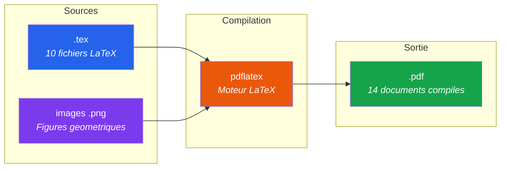
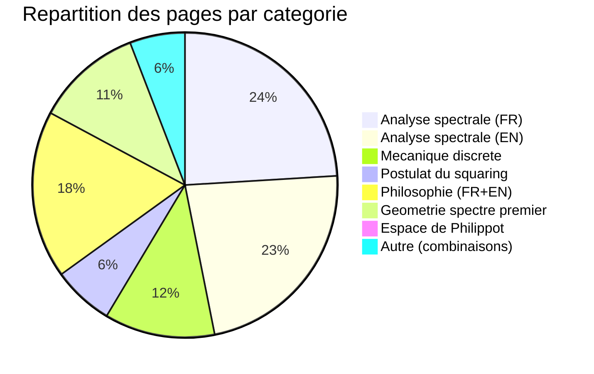
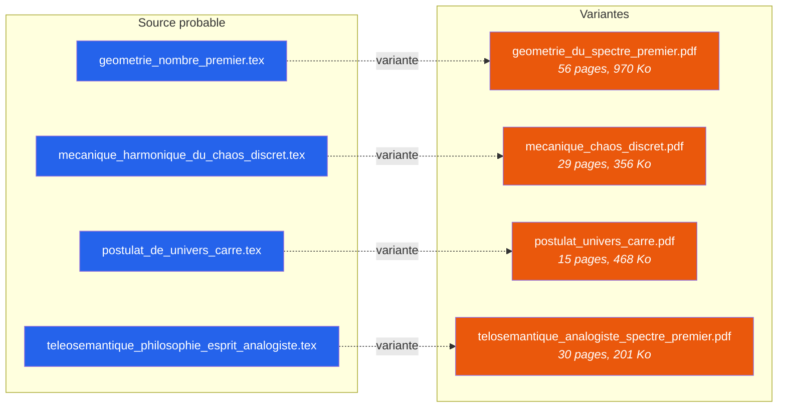

# Arborescence narrative PDF

## Documents compiles -- Theorie de l'Univers est au Carre

**Generee le :** 2026-04-13
**Documents PDF :** 14
**Total pages :** 499

---

## Pipeline de compilation

---

## Repartition des documents par categorie

---

## Correspondance Source → PDF

```mermaid
graph TD
    subgraph Sources LaTeX
        T1["analyse_hypothese_riemann_savard.tex"]
        T2["espace_de_philippot.tex"]
        T3["geometrie_nombre_premier.tex"]
        T4["geometry_prime_spectrum.tex"]
        T5["mecanique_harmonique_du_chaos_discret.tex"]
        T6["pilosophy_geometry_of_prime_number.tex"]
        T7["postulat_de_univers_carre.tex"]
        T8["prime_number_geometry.tex"]
        T9["teleosemantics_mind_analogist_philosophy.tex"]
        T10["teleosemantique_philosophie_esprit_analogiste.tex"]
    end

    subgraph PDFs compiles
        P1["analyse_hypothese_riemann_savard.pdf<br/><i>62 pages, 1074 Ko</i>"]
        P2["espace_de_philippot.pdf<br/><i>4 pages, 113 Ko</i>"]
        P3["geometrie_nombre_premier.pdf<br/><i>57 pages, 971 Ko</i>"]
        P4["geometry_prime_spectrum.pdf<br/><i>57 pages, 968 Ko</i>"]
        P5["mecanique_harmonique_du_chaos_discret.pdf<br/><i>29 pages, 338 Ko</i>"]
        P6["pilosophy_geometry_of_prime_number.pdf<br/><i>29 pages, 204 Ko</i>"]
        P7["postulat_de_univers_carre.pdf<br/><i>17 pages, 475 Ko</i>"]
        P8["prime_number_geometry.pdf<br/><i>56 pages, 964 Ko</i>"]
        P9["teleosemantics_mind_analogist_philosophy.pdf<br/><i>29 pages, 204 Ko</i>"]
        P10["teleosemantique_philosophie_esprit_analogiste.pdf<br/><i>29 pages, 201 Ko</i>"]
    end

    T1 --> P1
    T2 --> P2
    T3 --> P3
    T4 --> P4
    T5 --> P5
    T6 --> P6
    T7 --> P7
    T8 --> P8
    T9 --> P9
    T10 --> P10

    style T1 fill:#2563eb,color:#fff
    style T2 fill:#2563eb,color:#fff
    style T3 fill:#2563eb,color:#fff
    style T4 fill:#3b82f6,color:#fff
    style T5 fill:#2563eb,color:#fff
    style T6 fill:#3b82f6,color:#fff
    style T7 fill:#2563eb,color:#fff
    style T8 fill:#3b82f6,color:#fff
    style T9 fill:#3b82f6,color:#fff
    style T10 fill:#2563eb,color:#fff
    style P1 fill:#16a34a,color:#fff
    style P2 fill:#16a34a,color:#fff
    style P3 fill:#16a34a,color:#fff
    style P4 fill:#16a34a,color:#fff
    style P5 fill:#16a34a,color:#fff
    style P6 fill:#16a34a,color:#fff
    style P7 fill:#16a34a,color:#fff
    style P8 fill:#16a34a,color:#fff
    style P9 fill:#16a34a,color:#fff
    style P10 fill:#16a34a,color:#fff
```

---

## PDFs supplementaires (sans source .tex directe)

Les 4 PDFs suivants sont des variantes de compilation ou des versions anterieures :

---

## Tableau recapitulatif

| # | Fichier PDF | Pages | Taille | Source .tex |
|---|------------|-------|--------|-------------|
| 1 | `analyse_hypothese_riemann_savard.pdf` | 62 | 1074 Ko | `analyse_hypothese_riemann_savard.tex` |
| 2 | `espace_de_philippot.pdf` | 4 | 113 Ko | `espace_de_philippot.tex` |
| 3 | `geometrie_du_spectre_premier.pdf` | 56 | 970 Ko | variante |
| 4 | `geometrie_nombre_premier.pdf` | 57 | 971 Ko | `geometrie_nombre_premier.tex` |
| 5 | `geometry_prime_spectrum.pdf` | 57 | 968 Ko | `geometry_prime_spectrum.tex` |
| 6 | `mecanique_chaos_discret.pdf` | 29 | 356 Ko | variante |
| 7 | `mecanique_harmonique_du_chaos_discret.pdf` | 29 | 338 Ko | `mecanique_harmonique_du_chaos_discret.tex` |
| 8 | `pilosophy_geometry_of_prime_number.pdf` | 29 | 204 Ko | `pilosophy_geometry_of_prime_number.tex` |
| 9 | `postulat_de_univers_carre.pdf` | 17 | 475 Ko | `postulat_de_univers_carre.tex` |
| 10 | `postulat_univers_carre.pdf` | 15 | 468 Ko | variante |
| 11 | `prime_number_geometry.pdf` | 56 | 964 Ko | `prime_number_geometry.tex` |
| 12 | `teleosemantics_mind_analogist_philosophy.pdf` | 29 | 204 Ko | `teleosemantics_mind_analogist_philosophy.tex` |
| 13 | `teleosemantique_philosophie_esprit_analogiste.pdf` | 29 | 201 Ko | `teleosemantique_philosophie_esprit_analogiste.tex` |
| 14 | `telosemantique_analogiste_spectre_premier.pdf` | 30 | 201 Ko | variante |

**Total : 14 PDF, 499 pages**

---

*Generee depuis le repertoire src/pdf/ -- 14 documents compiles*
